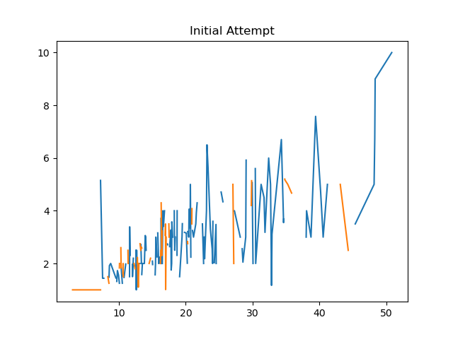
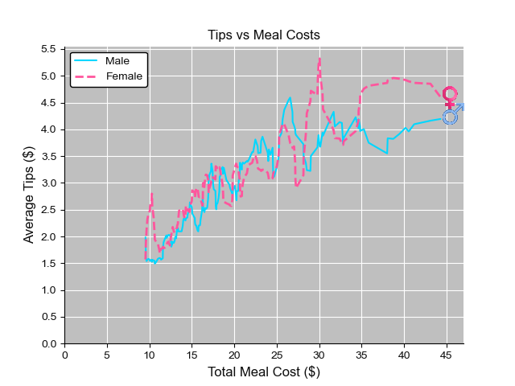

# Week_1_Visualization
Python code ccompanying Week 1 blog post for visualizations. This week's post is just creating basic linear plots, but by the end we create an animated plot with icons and decent aesthetics.
[Blog Post](http://discoveringdatascience.com/index.php/2020/07/27/week-1-the-line-chart/)

## Progression of Line Plots

This one is actually a video on the Blog.
